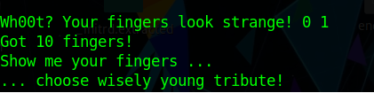

# Spanning Tree Qualifying: Dead Mans Two Fingers


## Description
Have you ever heard of Dead Mans Two Fingers? No? But maybe you have heard the birds chatter ...

Connect via SSH to dead-mans-two-fingers.codectf.localos.io:2222 to receive your IP. Then use local forwarding to connect to your IP to port 8888

## Flag
```
cyber_OOOverflow_like_a_pr0nstar
```

## Challenge files
- 3badb3b3c125c954599582dccffb638d


## Detailed solution

### First observations
When executed, the 32-bit linux binary (or the server, which runs it) displays a Prompt:

It seems, no keyboard input really makes a difference. However, keeping Return pressed, it shows a message:

On pressing other buttons and then keeping Return pressed, there is even an error message:

After some time, the application quits with the Words "Cya next time tribute!"

While not knowing at this point, how to deal with this, it points us in a direction.
A google search on "stack smashing" leads to the conclusion, that maybe we need to do a buffer overflow attack here on the input string.

A look into the executable with IDA Pro shows us a few fake flags and functions outputting them, however, they are not referenced anywhere.


### Experimenting with the input
We suspected, that input from console will likely not do much in this program, so we decided to pipe files generated with a hex editor to it.
```(sleep 1; cat file) | ./deadman```
We found out, that sending some random data of a length over 0x21 repeatably showed a Backtrace like this:

After some debugging, we found a place in the code, which seems to check, if to print this backtrace or not:

We spent way too much time, trying to get the input to reliably going the path showing the backtrace by putting an address of data matching the requirements of each one of the two pathes leading to the backtrace in there without any real result.
Also, we found out, that the first byte in the whole string changes the behavior in a, at that moment, unpredictable way.
We found out, we needed to find the exact meaning of the first byte.
After some trial and error, we found out, it seems to be the length of the string to be processed, which also explained the randomly looking results.

### Finding the vulnerability
We tried a lot and found, that if we wrote a length of more than 0x20 and then some random bytes, this triggered the first error (stack smashing) a lot, also sometimes we got the second error (the backtrace, always in combination with the first one).
We copied IDA linux debugging server binary to our VM and then modified the command from above to give as 20 seconds instead of one, so we could attach the debugger to the process.
Strangely, we saw, that two process IDs appeared (we chose to debug on the second one).
After unsuccessfully trying to find a good path from the backtrace (we found out, we could write something in EAX like magic, but it did not help at all),
we concentrated on the "stack smash detected" message. We found a function, which has a "strange" behavior: It writes something to the stack in the beginning and then checks it at the end. If it changed, it goes to the stack smashed message, if not, the program continues.

We made a breakpoint on the xor line and checked, what was going on. Each time, we ran it, the value, which was compared to what was on stack, was different. We decided to ignore it for now and manually set the IP to the correct branch (the one not leading to the error) manually.
It was now easy to see, that what we wrote after the offset of 0x20 (0x21 if you include the length byte), was directly pushed on the stack and the first value, unfortunately, overwrote the "magic" value, we could not identify for now (maybe because we were to tired and did not research more on the error message at that time).
We found, that we could easily set the return address and tried it in the debugger to get to one of the fake flag functions (which we suspected to return the real flag if run on the server, but it had a debugger trap so hmm...).
At least, we now had some kind of foothold.

### Stack canary
Next came the problem, that we always got that nasty "stack smashed" error... This time, reading the search results for that error more precisely and then considering the challenge description, we got to the point, that the "magic" random number has to be a stack canary of the random type.
Fortunately, there were good examples (https://book.hacktricks.xyz/reversing-and-exploiting/linux-exploiting-basic-esp/bypassing-canary-and-pie) using pwntools python library, which made use of the fact, that the process is forking, meaning it starts new child processes again and again but keeping the stack canary the same in between the calls.
With that library and the examples, we were relatively fast at the point, we got the stack canary cracked in a matter of a few seconds. Now we knew, what the Hint about the birds meant.

### Exploiting
Our next try was to put some own code directly on the stack and find a function to call this code. I did not remember exactly, which way we used, but it lead to a segfault.
After a short research, we found out, that we can't normally (and verified, that it is also the case here) run code from stack, as it is marked as non executable.
Short research lead us to the conclusion, we needed to do ROP (return oriented programming), or to say it in a more simple way, find addresses, which run a instruction we want and then return, which would in turn run the next function, whose address we put on the stack.
We found a few good tools for making this easier, however, ROPgadget (https://github.com/JonathanSalwan/ROPgadget) offered the easiest way (for us at that moment at least ^^) to accomplish this.
We ran
```ROPgadget --binary 3badb3b3c125c954599582dccffb638d --ropchain```
to generate a chain of commands, which run /bin/sh, hoping it will work. It was even so convenient, it directly generated it for us in python.
We then combined this with our stacksmashing tool, put in a break between the stack smashing and the sending of the real exploit and executed it, while using the time gap to attach to it with the debugger.
Indeed, it went smoothly through the stack canary check, but resulted in a segfault nonetheless. We did a mistake calculating the offset where to put the payload and had to experiment a bit with length and padding. in the end however...

As the exploit was now working locally, we used the advantages of pwntools and had to just rewrite a few lines to launch it against the server instead. Success was immediate, the file called flag.txt contained the flag. Sry, we did not save a screenshot of that part.

### Afterthoughts
We learned, that pwntools could have done the ROP part for us as well and even more automated and flexible.
This was the first time, i did a format string / buffer overflow attack at all. I never heard of anything like a stack canary or ROP before.
I did learn *A LOT* in this challenge, even at 5 AM with only 2 hours of sleep.
This will almost certainly be of much help for me in the future, not just at the main CtF event.

Thanks for this great Challenge, Team Localos!!!

### Script
crackcanary.py does the complete attack locally, despite its naming.